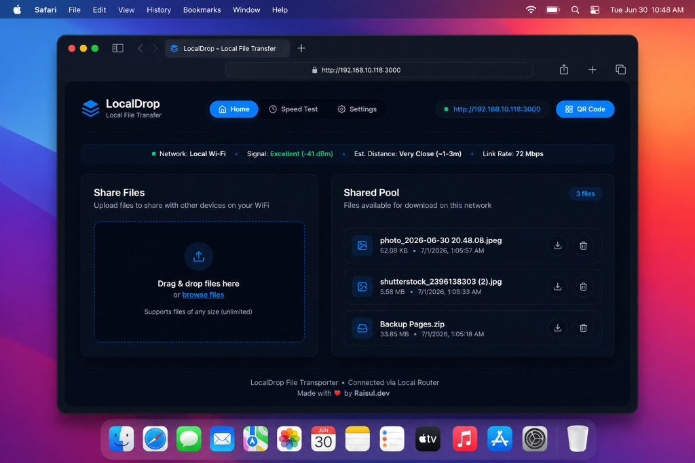
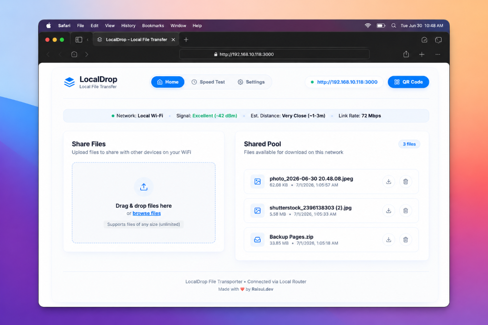
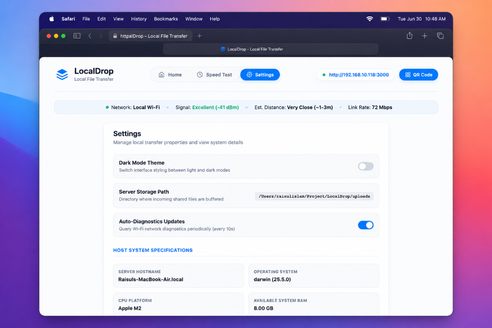
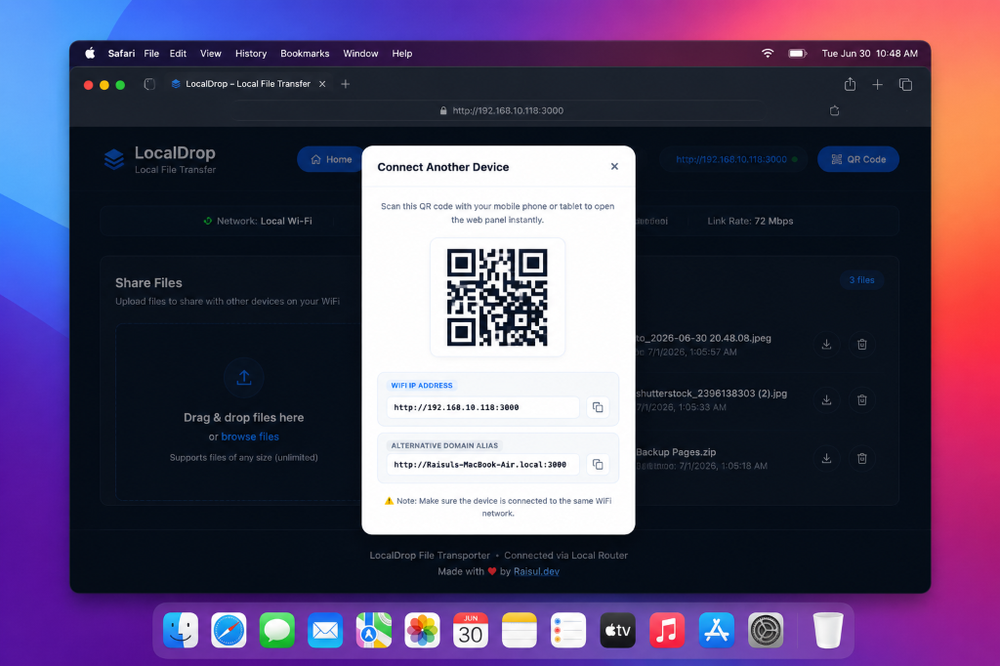

# ⚡ LocalDrop

LocalDrop is a lightweight, high-performance, and completely offline LAN (Local Area Network) file sharing platform. It enables lightning-fast file sharing between multiple devices (laptops, mobile phones, tablets) connected to the same Wi-Fi router—without requiring internet connectivity, third-party apps, or cloud uploads.

---

## 🚀 Key Features

* **Zero-Configuration Portability:** Runs instantly on any host machine with Node.js installed. Just run it, scan the QR code, and start sharing.
* **Completely Offline:** All data remains inside your local router's network. No internet bandwidth is consumed.
* **Real-time Live Sync:** Uses a robust WebSocket synchronization engine to push instant file list updates across all connected devices in real time.
* **High-Performance Transfers:** Uses streaming binary structures bypassing Node.js socket timeouts, allowing you to share files of any size (unlimited) constrained only by your disk space.
* **Wi-Fi Diagnostics & Location Profiling:** Employs macOS system-level profiling (`SPAirPortDataType`) to monitor Wi-Fi signal parameters (RSSI dBm), estimated distance, channel info, and link rate in real time.
* **Built-in Local Speed Benchmark:** Includes a non-linear responsive dial speedometer to benchmark Ping (latency), download, and upload speeds directly between clients and the host server.
* **QR Code Auto-Generation:** Renders offline-safe QR connection codes matching your network IPv4 and local multicast hostname (`.local`) addresses.
* **Premium UX/UI:** Polished UI featuring a smooth responsive layout, drag-and-drop file inputs, file-type icons catalog, and a state-saving dark/light mode.

---

## 📸 Interface Showcase

| Primary Dashboard (Dark Mode) | Primary Dashboard (Light Mode) |
| :---: | :---: |
|  |  |

| System Settings & Hardware Specifications | Offline QR Connection Modal |
| :---: | :---: |
|  |  |

---

## ⚙️ Quick Start Installation

Follow these steps to launch the server on your local machine:

### 1. Prerequisites
Ensure you have [Node.js](https://nodejs.org/) installed (v16.x or newer is recommended).

### 2. Download and Setup
Clone or download this repository, navigate to the directory, and install dependencies:

```bash
# Navigate to project folder
cd LocalDrop

# Install node modules
npm install
```

### 3. Start the Server
Run the default start script:

```bash
npm start
```

On successful launch, your terminal will log your access addresses:
```text
==================================================
 LocalDrop server is running!
 Local Access:      http://localhost:3000
 WiFi IP Access:    http://192.168.10.118:3000
 WiFi Host Access:  http://Raisuls-MacBook-Air.local:3000
==================================================
```

---

## ⚡ Production Deployment (Auto-start via PM2)

To keep the LocalDrop server running permanently in the background and ensure it launches automatically when your system boots up, we recommend using [PM2 (Process Manager 2)](https://pm2.keymetrics.io/).

### 1. Install PM2 Globally
```bash
npm install -g pm2
```

### 2. Start the Server Daemon
Start `server.js` and assign it a readable name:
```bash
pm2 start server.js --name localdrop
```

### 3. Setup Startup Boot Scripts
Generate and configure active startup scripts for your OS (macOS/Linux/Windows):
```bash
pm2 startup
```
*Note: PM2 will output a specific command to copy-paste into your terminal. Run that generated command with `sudo` permissions to register the system service daemon.*

### 4. Save Current Process Configuration
Lock the active process configuration so it restores on boot:
```bash
pm2 save
```

### Useful PM2 Control Commands:
```bash
# Monitor logs in real time
pm2 logs localdrop

# Check hardware/memory dashboard
pm2 monit

# Stop or Restart the server
pm2 stop localdrop
pm2 restart localdrop

# Remove server process from startup
pm2 delete localdrop
```

---

## 🛠️ Architecture & Specifications

* **Backend core:** Express.js, Node.js HTTP Streaming, `ws` (WebSockets library), `qrcode`.
* **Frontend core:** Vanilla ES6 Javascript (SPA tab-routing, native XMLHttpRequest progress hooks), Vanilla CSS custom layout tokens.
* **Network diagnostics:** Calls system binaries asynchronously to grab Wi-Fi telemetry statistics. Features location privacy checks to bypass macOS Sonoma/Sequoia SSID location restrictions.
* **No size limits:** Bypasses Node socket timeout parameters (`server.timeout = 0`) to preserve heavy streams, preventing timeouts on large GB+ files.

---

## 📄 License
Distributed under the ISC License. Created with ❤️ by [Raisul.dev](https://raisul.dev).
